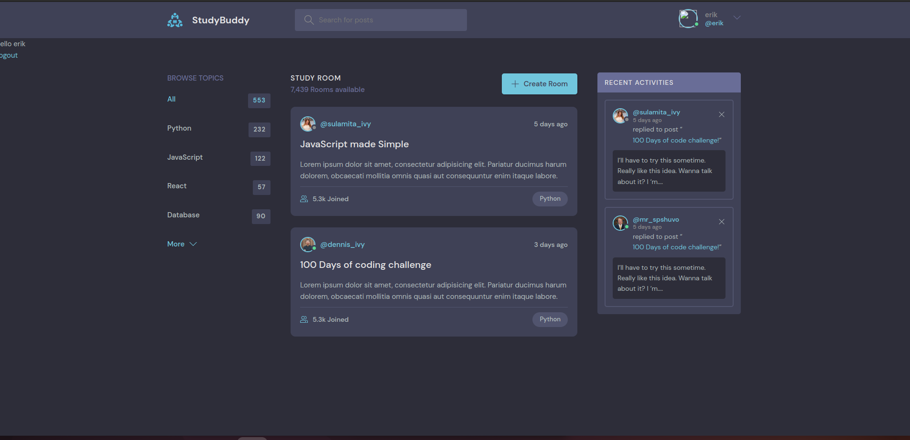

This project create website for user can learn programming languages
So user can create room, talk and chat with.(Restricted Pages)
User can registration!

--> Create a virtual environment
For windows: 
* pip install virtualenv
* virtualenv envname
--> Activate the virtual environment :
* envname\scripts\activate
--> Install the requirements :
pip install -r requirements.txt

<h1>Running the App:</h1>
--> To run the App, we use :
python manage.py runserver

* So you can run for db other or docker!
* 

I'm doing
